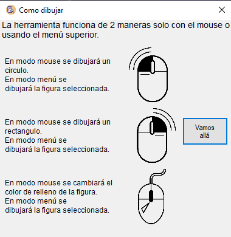
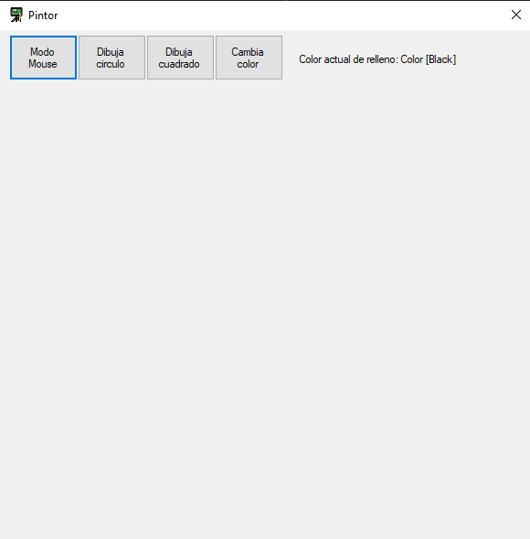
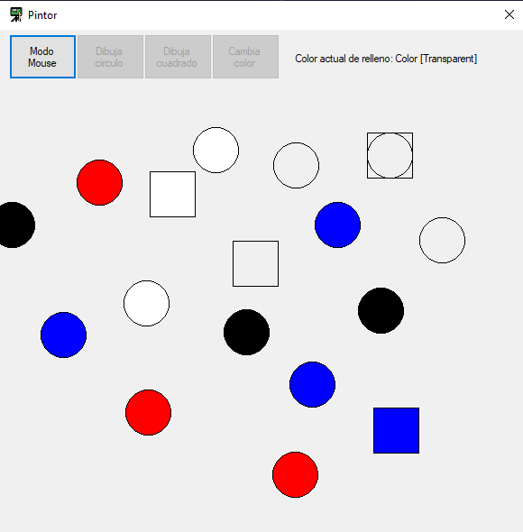
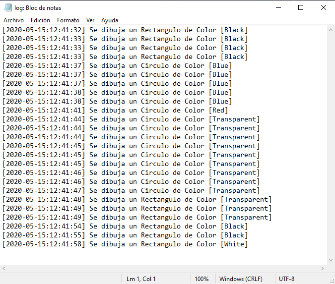

# Pintor de Figuras (Cuadrado y Circulos)
Programa encargado de dibujar cuadrados y circulos, ademas de crear un log donde se vean todas las figuras creadas, dia y hora.  
[Codigo de Instrucciones](./Introduccion.cs) Se muestran las instrucciones de como funciona el pintor.  
[Codigo de Pintor](./Pintor.cs) Se muestra como se agregaron todos los componentes en la intefaz.  
[Codigo de Funciones Genéricas](./Funciones.cs) Funciones Genéricas para modelar las ventanas que se usarán.  
[Codigo de Panel de Control](./Menu.cs) Lista de controles para el correcto funcionamiento del pintor.  
[Codigo de log](./Registro.cs) Clase con finalidad de crear los registros dentro del archivo log.  
Instrucciones:  
  
Lienzo para pintar:  
  
Figuras dibujadas en el lienzo:  
  
Estilo del archivo tipo log:  
