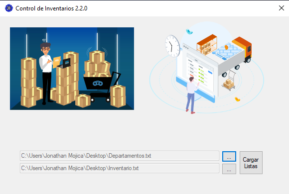

# Control de Inventarios v2.2

[Módulo de Pantalla Inicio](./Read/PInicio.md) Pantalla de Arranque para cambiar a diferentes módulos.  
[Módulo de Registro](./Read/MRegistro.md) Modulo para registrar nuevo producto o actualizarlo.  
[Módulo de Consulta](./Read/MConsulta.md) Módulo encargado de cotejar la base de datos de Inventario.  
[Módulo DB](./Read/DB.md) Módulo encargado de cargar y guardar listas.  