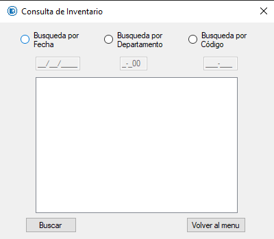

# Módulo de Consulta Inventario
Modulo encargado de revisar el archivo cargado de inventario.  
Cuenta con 3 formas de Consultar.  
* Por fecha de lanzamiento.  
* Por codigo de Departamento.  
* Por codigo de Producto.  
Este módulo contiene un [submódulo](./SMConsulta.md).  
  
[Código Clase Principal](../Consulta.cs) Parte Inicial de la Clase  
[Código Componentes](../Consulta_Elementos.cs) Todos los controles que se ven en la ventana.  
[Código Eventos](../Consulta_Eventos.cs) Todos los eventos que ocurren al interactuar con ciertos controles.