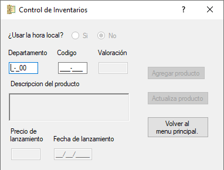

# Módulo de Registro/Actualización
Módulo encargado de registrar un nuevo producto en la DB Inventario, en caso que haya un producto con el mismo código y departamento en la DB
se actualizarán sus componentes.  
  
[Código Clase Principal](../Inventario.cs) Parte Inicial de la Clase  
[Código Componentes](../Inventario_Elementos.cs) Todos los controles que se ven en la ventana.  
[Código Eventos](../Inventario_Eventos.cs) Todos los eventos que ocurren al interactuar con ciertos controles.