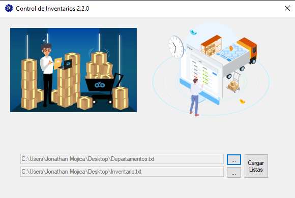

# Módulo principal
Pantalla de inicio donde se muestran 2 imagenes para redireccionar a los módulos de [registro](./MRegistro.md) y 
[consulta](./MConsulta.md), también tiene un apartado donde cargar una nueva lista de Departamentos y de Inventarios.  
  
[Código Clase Principal](../Pantalla_Inicial.cs) Parte Inicial de la Clase.  
[Código Componentes](../Pantalla_Elementos.cs) Todos los controles que se ven en la ventana.  
[Código Eventos](../Pantalla_Eventos.cs) Todos los eventos que ocurren al interactuar con ciertos controles.