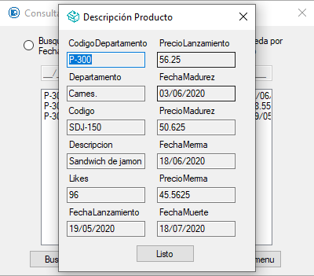

# Submodulo Despliegue de Resultado.
Submódulo encargado de desplegar todos los datos de un producto resultado en textBox.  
Este submódulo se despliega como un MessageBox.  
  
[Código de form modificada](../ProductBox.cs) Modificación de una form para ser desplegada como messageBox.